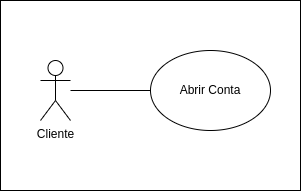
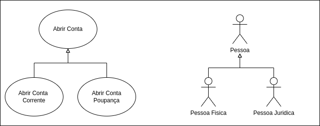
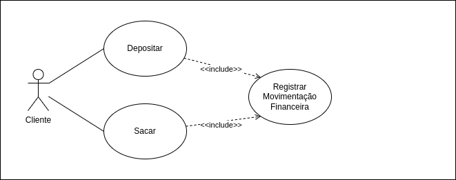
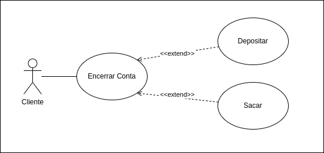
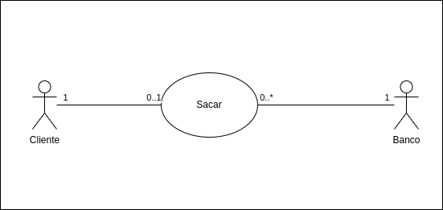

# Diagrama de Caso de Uso

O Diagrama de Casos de uso é um dos diagramas mais utilizados, principalmente na fase inicial de levantamento de requisitos. Possúi uma composição simples e de facil entendimento, por esse motivo é uma excelente ferramenta para um entendimentog eral do comportamento do sistema, atendendo diferentes perfis(Analista de requisitos, Desenvolvedores, QA, Product Owners)

Esse diagrama procura identificar os atores( usuarios, funcionarios, sistemas, hardwares) e as funcionalidades que o sistema disponibilizará aos atores. 

O Diagrama de Casos de uso é um dos diagramas mais utilizados, principalmente na fase inicial de levantamento de requisitos. Possúi uma composição simples e de facil entendimento, por esse motivo é uma excelente ferramenta para um entendimentog eral do comportamento do sistema, atendendo diferentes perfis(Analista de requisitos, Desenvolvedores, QA, Product Owners)

Esse diagrama procura identificar os atores( usuarios, funcionarios, sistemas, hardwares) e as funcionalidades que o sistema disponibilizará aos atores. 

Ex: Em um sistema bancário podemos ter um ator que e o Cliente e um caso de uso que é Abrir Conta

## Documentacao de casos de uso

### Associacao

### Especialização/Generalização

### Inclusão

### Extensão
Extensão sao utilizadas para descrever cenarios opcionais, ou melhor dizendo cenários que somente acontecerão se uma condição for cumprida. 

No caso de um sistema bancario, para encerrar conta o saldo precisa ser ZERO, se o sando for positivo, o clietne necessitará efetuar um saque, se o saque for negativo, o cliente necessitará efetuar um depósito. 

### Relacao 1 apra 1 /1 para Muitos

