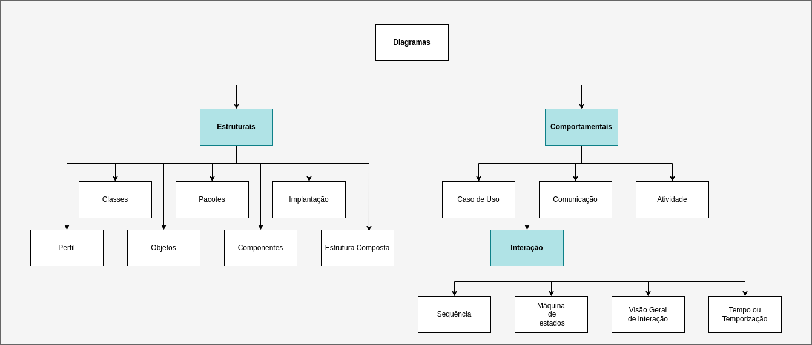

# Sobre a UML

# Os diagramas

Os diagramas na UML podem ser divididos em dois tipos, diagramas de Comportamento ou diagramas estruturais.

E cada um tipo possui diagramas que representam estruturas distintas que auxiliam a compreender o software que desenvovlemos.

Diagramas de comportamento
- Caso de Uso
- Sequencia
- Colaboracao
- Interação
    - Maquinas de estado
    - Atividade
    - Visão geral de Interação
    - tempo ou Temporaizaç~ao

Diagramas estruturais
- Classes
- Objetos
- Pacotes
- Componentes
- Implementacao
- Estrutura Composta
- Perfil

## Comportamentais

Os diagramas comportamentais, como o nome diz, representam comportamentos da "features" do sistema ou um processo de negócio. 

### Diagrama de Caso de Uso

O Diagrama de Casos de uso é um dos diagramas mais utilizados, principalmente na fase inicial de levantamento de requisitos. Possúi uma composição simples e de facil entendimento, por esse motivo é uma excelente ferramenta para um entendimentog eral do comportamento do sistema, atendendo diferentes perfis(Analista de requisitos, Desenvolvedores, QA, Product Owners)

Esse diagrama procura identificar os atores( usuarios, funcionarios, sistemas, hardwares) e as funcionalidades que o sistema disponibilizará aos atores. 

#### Documentacao de casos de uso

|Nome do Caso de Uso | Abrir Conta|
|---|---|
|Caso de Uso Geral||
|Ator Principal|Cliente|
|Ator Secundarios|Funcionário|
|Resumo|Descricao dos passos para abertura de conta|
|Pré-condições|Pedido precisa ser aprovado|
|Pós-Condições|Efetuar depósito inicial|
|Fluxo Principal||
|Ações do ator|Ações do sistema|
|1. Solciitar Abertura de Conta||
||2. Analisar pedido|
||3. Verificar Documentos|
|4. Registrar Senha||
|5. Fornecer valor de deposito||
||6. Registrar deposito|
||7. Emitir Cartao|
|Fluxo Alternativo|Atualizar cadastro|
|Ações do ator|Ações do sistema|
||1. Atualizar cadastro do cliente|
|Fluxo de Exceção|Documentacao minima pendente|
|Ações do ator|Ações do sistema|
||1. Comunicar pendencia de documentos|
||2. Recusar o Pedido|

### Diagrama de Atividade
O diagrama de atividade representa o fluxo de controle de atividade. 
Pode ter suas operacoes baseadas nos casos de uso e demonstrar o fluxo de cada operacao, suas operacoes logicas ate sua conclusao.

### Diagrama de Comunicação
\

## Interação

### Diagrama de Sequencia
O diagrama de sequencia apresenta uma ordem temporal de acontecimentos, onde as mensagens trocadas entre os objetos em um determinado processo. Utiliza como base os casos de uso e a estrutura de classes para determinar o processo/fluxo que determinada funcionalidade acontecerá.

### Diagrama de Maquina de estados

Demonstra o comportamento de um elemento por um conjunto finito de transicoes de estado. 

Pode se basear no caso de uso 

### Diagrama de Visão geral de interação
É uma variacao do diagrama de atividade, porem fornece uma visao geral do sistema ou processo de negocio. 

### Diagrama de Tempo ou Temporização
Descreve a mudanca no estado ou codnicao de uma instancia de uma classe ou seu papael durante um tempo. 

Utilizado para demostrar mudanca de estado no tempo em resposta a outro evento. 

## Estruturais

### Diagrama de Classes
O diagrama de classe é considerado um dos mais importantes e mais utilizados da UML. 
Ele define a estrutura de classes utilziadas pelo sistema. Determinando atributos e metodos de cada classe. 

Obs: serve de base/apoio para outros diagramas

### Diagrama de Objetos
Os diagramas de Objetos servem como um complemento do diaggrama de classe, fornecendo uma visão dos valores armazenados por um objeto gerado através das classes. 

Exempo um classe pessoa:

|Pessoa|
|---|
|- nome = Jose Luis|
|- endereco = Rua bom sucesso,4 - 03333-333 São paulo/SP|
|- idade = 42|

### Diagrama de Pacotes
O diagrama de pacotes representa subsistemas ou submodulos que compoem o sistema.
Pode ser utilziado em conjunto com outros diagramas ou de forma isolada. 

Pode tambem auxiliar a demonstrar uma arquitetura ou estrutura de uma linguagem. 

### Diagrama de Componentes
Muito associado a linguagem de programacao utilziada e arquitetura da solucao

### Diagrama de Implantação
Esse diagrama determina as necessidade de hardware para aquele sistema, caracteristicas fisicas  como servidores, estacoes, protocolos, topologias

### Diagrama de Estrutura Composta
Descreve uma estrutura interna de um classificador, como uma classe ou componente. 

Detalha estrutura internas que compoem e descreve como elas colaboram entre si. 

### Diagrama de Perfil